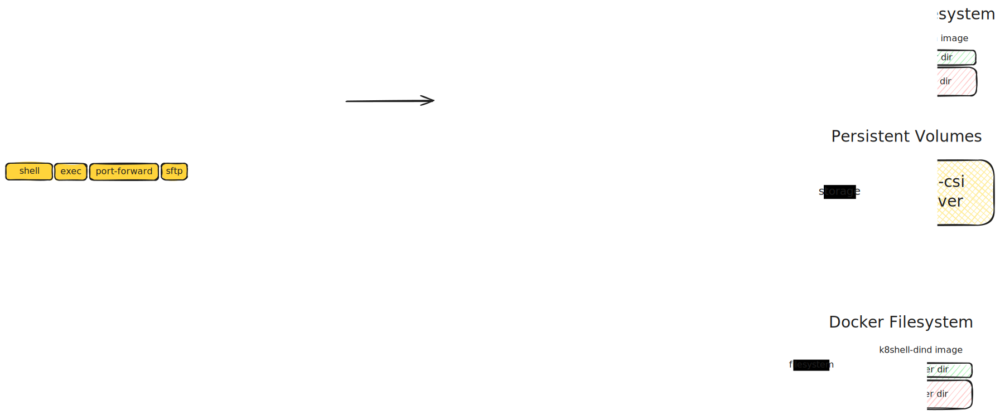

# k8shell workspace

```{abstract}
A K8shell workspace is a Kubernetes Pod offering you a development environment with standard tools and protocols.
```

A workspace is a dedicated resource for a single user. It is dynamically created by the k8shell proxy when the user connects to the system. It is based on a blueprint defining access and resource requirements and may consist of one or more containers. The workspace provides shell, SFTP, port-forwarding, and agent-forwarding capabilities while remaining isolated with its own network namespace, filesystem, and process space. It can also enable Docker functionality and access to private registries. Depending on the configuration, the workspace can be ephemeral, automatically destroyed upon disconnection, or preserved for an extended period. 



## Workspace provisioning

Workspace provisioning is initiated by the k8shell proxy based on the user requesting an access to the workspace (see [SSH Channel Flow](communication.md#ssh-channel-flow) for more details). K8shell proxy uses the workspace blueprint that the user requests access to. The blueprint defines the Helm chart and configuration values needed to deploy the workspace, including container images, resource requirements, initialization scripts, storage, middleware (e.g., VSCode or IntelliJ detection plugins), and access permissions. Workspaces can also be configured to support Docker, allowing users to build, run, and manage containers while accessing private container registries. Provisioning typically takes 4-6 seconds, depending on the container image size and initialization script complexity.

The workspace provisioning process involves the following steps:

1. **Instantiation of the workspace blueprint:** The k8shell proxy processes the workspace blueprint for the user requesting access. This step generates user-specific values such as username, read/write permissions, and workspace name. The k8shell proxy uses a templating mechanism with CEL expressions to dynamically generate these values based on user data.

2. **Helm chart installation:** The Helm chart, containing the Kubernetes resources that define the workspace, is installed in the specified Kubernetes namespace. These resources include the workspace pod with requested container definitions, service account, persistent volume claims, initialization scripts, access token for the k8shell proxy API, and other necessary components. The Helm client communicates with the Kubernetes API server to deploy the chart and create the required resources, including storage, networking, and containers.

3. **Running init containers:** The workspace pod uses two init containers: init-base and init-user. The init-base container copies essential workspace base tool binaries and scripts to the workspace filesystem. These binaries include k8shell-init and kbox, which provide various tools for interacting with the k8shell system. The init-user container sets up the user environment by creating the user account (including the username, UID, and GID) and initializing the user’s home directory.

4. **Running main and dind containers:** After init containers finish the work, the main and dind containers are started. See [Workspace containers](#workspace-containers) for more details.

```{note}
Workspace blueprints allow you to define any storage class available in the cluster. However, k8shell services provide a CSI storage driver for creating persistent volumes on a ZFS storage server. See [Storage architecture](storage.md) for more details.
```

## Workspace containers 

The provisioning process creates main and dind containers (if configured) within the workspace pod. They support various K8shell operations, they share a network namespace but have separate process namespaces. The containers use shared `emptyDir` volume, shared network namespace, unix socket, and persistent storage.

The diagram below shows the containers and their integration. 

```{eval-rst}
.. gdrawing:: 1l46s0YZWikxWQoM0UYQaDV3e2zGQYFiOoeKlbKemz6I
```

### k8shell-main

The k8shell-main container serves as the primary component of the workspace pod, facilitating shell access, port forwarding, and SFTP streams. It uses a specialized container image tailored to the tasks users perform within the workspace. When the workspace is provisioned, the k8shell-main container executes initialization scripts defined in the workspace blueprint. These scripts run during the Pod’s start lifecycle event and can include tasks such as configuring the user environment (e.g., Git settings, shell aliases) and installing packages for specific programming environments. To optimize provisioning time, scripts can also be configured to run in the background, ensuring they don’t delay workspace readiness.

The k8shell-init is the init process of the main container (PID 1), responsible for reaping zombie processes, killing orphaned processes, managing the workspace logger, providing a Unix socket-to-TCP bridge for SSH agent forwarding, and enabling TCP port forwarding to various services. 

The main container provides the following functions:

1. **SSH channels**: Users can connect to the workspace via various SSH channels. The k8shell-proxy manages the SSH connection, forwarding input and output streams between the user and the container within the channel. There are [shell](communication.md), [exec](communication.md), and [port-forwarding](communication.md#port-forwarding) channels supported by k8shell-proxy. 

2. **SSH agent forwarding:** When SSH agent forwarding is requested, the k8shell proxy initiates the process by sending a request to the k8shell-init process running in the workspace's main container. The k8shell-init process then establishes a bridge, which consists of both a TCP listener and a Unix socket listener. The k8shell proxy connects to the TCP listener by creating a TCP socket. When a client running inside the workspace container needs access to the SSH agent, it connects to the Unix socket. The bridge transforms the communication between the Unix socket and the TCP socket. The transformed communication is then received by the k8shell proxy, which forwards the request to the SSH agent running on the user's host, enabling seamless agent forwarding. See [Agent forwarding](communication.md#agent-forwarding) for more details. 

4. **SFTP subsystem**: Enables the file transfer via SFTP server. When the SFTP subsystem is requested by the client on the SSH connection, the k8shell proxy forwards input and output streams to the sftp server. The server is either provided by the k8shell-main container or k8shell-proxy uses internal server implementation if the container image lacks an SFTP server. See [SFTP subsystem](communication.md) for more details.

5. **Persistent storage**: Users can store data on the persistent volumes. These volumes can include shared storage accessible to other workspaces.

The k8shell-main container also uses logging service provided by k8shell-admin container and may use local DNS provided by k8shell-dind container (if configured). See [k8shell-admin](#k8shell-admin) and [k8shell-dind](#k8shell-dind) for more details. 

### k8shell-dind

The k8shell-dind container is a sidecar in the workspace pod that provides Docker support and local DNS resolution services. It runs a Docker-in-Docker (dind) container image and shares the network namespace with the main container.

The dind container provides the following functions. 

1. **Docker daemon:** The dind container runs a Docker daemon, allowing users to build, run, and manage containers within the workspace. The main container communicates with the Docker daemon via a Unix socket shared between the containers on an `emptyDir` volume. 

2. **Local DNS service:** The dind container runs a local DNS service that provides name resolution for Docker containers within the workspace. The local DNS service is optional and can be disabled in the workspace blueprint. 

For more details on how the workspace user interacts with the Docker daemon and utilizes the local DNS service, refer to the [Docker Support](#docker-support) section.

## Network access

All containers in the workspace share the same network namespace. The following network interfaces are available in the workspace pod:

1. **eth0:** The primary network interface of the workspace pod, assigned an IP address from the cluster’s IP pool. Communication with other pods and services within or outside the cluster can be controlled using network policies configured in the workspace blueprint. See [network policy](#network-policy) for more details.

2. **docker0** or **veth(n):** Bridge network interfaces created by the Docker daemon in the dind container. These are used for communication between the main container and Docker containers within the workspace. The Docker daemon assigns IP addresses to containers from the bridge network. Additional bridge network interfaces may be created by the Docker daemon in the dind container, for example, when the user defines a custom Docker network or uses Docker Compose.

### Network policy

The network policy allows to control how the workspace pod communicates with other pods and services within or outside the cluster. The network policy is defined in the workspace blueprint and can be configured at the following levels. Please note that by default, egress to public IPs is always allowed, and egress to system pods is blocked.

| Level | Igress/egress traffic rule |
|-------|-------------|
| `isolated` | **not allowed** to/from any workspaces, pods or networks |
| `user` | allowed to/from workspaces of the **same user** in the same organization |
| `workspace` | allowed to/from workspaces of the **same blueprint** in the same organization |
| `organization` | allowed to/from **all workspaces** of the same organization |
| `system` | allowed to/from **all networks**, including system pods and private IPs |
| `none` | no policy applied; ingress and egress are **not restricted** |

In addition, it is possible to specify a set of labels that the target pod must have to allow the traffic. The labels are defined in the workspace blueprint and can be used to restrict the traffic to specific pods or services.

```{note}
The network policy is enforced by the Kubernetes network plugin. The levels outlined in the table above correspond to the `spec.ingress` and `spec.egress` fields in the `NetworkPolicy` resource.
```

## Docker support 

The k8shell-proxy supports Docker in the workspace by enabling k8shell-dind container (Docker in Docker). It comes with a Docker daemon, the local DNS service and docker credential helper to access private container registries. 

### Local DNS

The local DNS provides name resolution for Docker containers and enables the override of Kubernetes service names. This feature supports the development of application components within the workspace that need to be “isolated” from existing Kubernetes services. The local DNS is optional and can be disabled via the workspace blueprint. The local DNS service is provided by the k8shell-dind container. When the container starts, the following components are initialized:

1. **dnsmasq:** The local DNS starts the dnsmasq process and updates the /etc/resolv.conf file in the workspace to point to the local DNS at 127.0.0.53. Unresolved queries are forwarded to the upstream coreDNS server. The modified resolv.conf file is shared across all containers in the workspace pod.

2. **Event Listener:** This listener monitors events from the Docker daemon, adding DNS entries for newly created containers. These entries are automatically removed when containers are deleted.

The workspace blueprint can be configured to specify which entries are added to the DNS. The following options are available with their default values:

| Option | Default|Description |
|--------|-|-------------|
| `container_name` |`false`| Adds the container’s name to the DNS (can be generated). |
| `container_id` |`false`| Adds the container’s ID to the DNS (first 12 characters). |
| `dns_names` |`true`| Adds the container’s DNS names to the DNS (see note below). |
| `cluster_fqdn` |`true`| Appends the cluster's FQDN to all DNS entries. |

```{note}
The DNS names are typically available when the container is started using Docker Compose. The entries can be found in the container manifest under `NetworkSettings.Networks.DNSNames`
```

### Credential helper

TODO

### Docker workflow

The following diagram shows components involved in the Docker workflow in the workspace. Please note that registry is an external container registry service. 

```{mermaid}
:config: { "theme": "neutral", "mirrorActors": false, "height": 50, "showSequenceNumbers": true, "width": 150, "fontSize": 22 }
sequenceDiagram
    participant P as k8shell-proxy
    participant M as k8shell-main
    participant D as k8shell-dind
    participant N as local DNS
    participant R as Registry

    M->>M: docker pull
    activate M
        M->>P: get credentials
        P-->>M: username,password
        M->>D: authenticate, docker pull
        D->>R: authenticate, image pull
        R-->>D: image content, store image in filesystem
        D-->>M: image available
    deactivate M
    M->>D: docker run
    activate M
    activate D
        note right of D: container running
        D->>N: add entry to local DNS
        D-->>M: container running
    deactivate M
        M->>N: resolve container name
        activate M
            note left of M: access container<br/>process on container<br/>name and port
            N-->>M: container IP
            M->>D: access process
        deactivate M
    deactivate D
```

* In steps {c}`1`, {c}`2`, {c}`3`, and {c}`4`, the user in the workspace runs the docker pull command to fetch an image from the registry. The Docker CLI uses the credential helper configured in the workspace, which retrieves credentials via an API call to the k8shell proxy. In steps {c}`5`, {c}`6`, and {c}`7`, the Docker daemon authenticates the user with the registry and pulls the image, storing it in the workspace filesystem.

* In steps {c}`8`, {c}`9`, and {c}`10`, the user executes the docker run command to start a container. The Docker daemon creates the container, and the local DNS service retrieves the associated event, creating a DNS entry for the new container.

* In step {c}`11`, the user starts a local process in the workspace that connects to a container process by resolving its name and accessing a specific TCP port where the container process is listening. In step {c}`12`, the local DNS (`dnsmasq` service) resolves the container name to its IP address, enabling the local process to communicate with the container.

```{note}
The local DNS allows direct access to container processes from the workspace network. This works because the container IP is part of a subnet attached to the bridge interface accessible from the workspace network. The IP address is routable within the workspace network, enabling direct communication with container processes without exposing ports using Docker's `-P` option.
```

Users can access all Docker features within the workspace, including running containers, building images, and pushing them to a registry. While the k8shell proxy provides access to the system’s registered container registry, users can also configure the Docker CLI with their own credentials to use a custom registry.

## Workspace Lifecycle

The k8shell proxy manages the workspace lifecycle, handling creation, updates, and deletion based on user requests. The lifecycle consists of the following stages:

1. **Create:** The k8shell proxy provisions a workspace using the workspace blueprint. The workspace pod is scheduled on a cluster node, and the containers are initialized according to the blueprint's configuration. See [Workspace provisioning](#workspace-provisioning) for details.

2. **Operate:** Users interact with the workspace by executing commands, editing files, and managing Docker containers. The k8shell proxy facilitates the SSH connection, ensuring input and output streams are seamlessly forwarded between the user and the workspace.

3. **Restart:** The main container in the workspace can be restarted if needed. This process is managed by Kubernetes, and users can trigger it by running the `shutdown` or `kill 1` commands within the workspace. See [K8shell proxy API](#k8shell-proxy-api) for more details.

4. **Delete:** Workspaces can be deleted either automatically when the user disconnects (if configured in the blueprint) or manually. The deletion process, managed by Helm, removes all associated resources, including stopping containers and deleting the pod from the cluster. Persistent volumes may either be deleted or retained, depending on the storage class configuration. If the ZFS CSI storage driver is used and volumes are retained, they can be reused when the workspace is recreated. See [Storage architecture](storage.md) for additional information.

5. **Update:** When a workspace blueprint changes, the k8shell proxy enforces the update policy specified in the blueprint. The policy defines how and when updates occur, with the following options:

| Policy       | Description                                              |
|--------------|----------------------------------------------------------|
| `onconnect`  | Updates are applied when the user reconnects to the workspace. |
| `immediate`  | Updates are applied as soon as the blueprint is modified. |
| `manual`     | Updates are applied only when explicitly requested.       |

During an update, the k8shell proxy uses Helm to reconfigure the workspace with the new blueprint values. Depending on the changes, the update may or may not restart the containers. In some cases, the update might require recreating the workspace.

## K8shell API 

TODO: API
