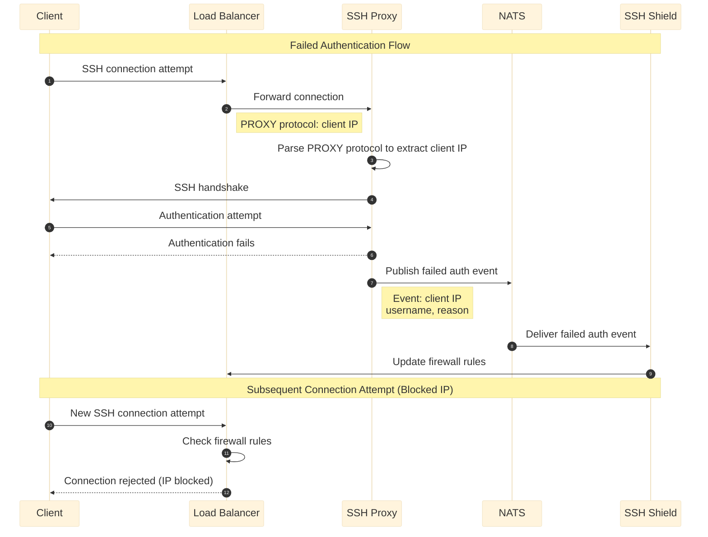

# Incoming Connections 

The SSH Proxy runs as multiple instances within the Kubernetes cluster. Each instance listens on a TCP port (default is `tcp/2022`), which is exposed externally as `tcp/22` through a LoadBalancer service. When SSH Proxy receives a new connection, it spawns a child process to handle the connection.

Because of how Kubernetes handles internal networking, the SSH Proxy cannot determine the actual client IP directly from the TCP socket. Instead, it relies on the PROXY protocol, which carries the client’s IP address. This protocol must be injected into the TCP connection by the external load balancer at the entrypoint.

## IP Address Protection and Blocking

Because TCP/22 is a common public entry point, it is frequently targeted by automated bots and attackers attempting to gain unauthorized access using various usernames and authentication methods. To mitigate this risk, the external TCP/22 endpoint should be protected with security mechanisms capable of blocking incoming connections once suspicious activity or defined thresholds are detected. 

To address this, the architecture is extended with two capabilities: the SSH Shield service and the ability to publish failed connection events. The SSH Proxy publishes details of failed authentication attempts via the NATS messaging middleware, including the client IP address, attempted username, and reason for failure. The SSH Shield subscribes to these events and applies rule-based policies to block malicious connections at the network layer using `nftables`.

The following diagram illustrates the details of this communication flow.

For more details on how SSH Shield blocks the IP addresses, see [SSH Shield service]().

