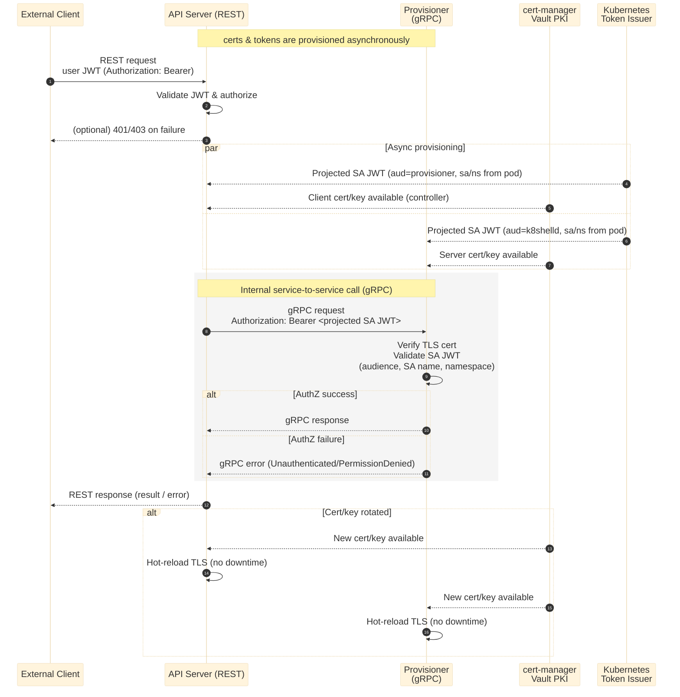

# API and gRPC Integration

External and internal integrations in K8shell are handled through two complementary communication layers.
Externally, access to K8shell is mediated by the API Server, which exposes a REST API for all external clients. The API Server manages user authentication and authorization using JWT tokens and enforces access policies before forwarding requests to internal services such as Identity, Session, Provisioner, or workspaces running k8shelld.

Internally, service-to-service communication within the K8shell system uses gRPC. Each service authenticates requests using a short-lived JWT issued by the Kubernetes token issuer, based on the caller’s service account and namespace. The client includes this token as a bearer credential when calling another service. The receiving service validates the token audience and verifies that the request originates from an authorized service account and namespace before processing it.

All gRPC traffic is secured with TLS. Certificates and private keys are automatically provisioned and rotated through cert-manager integrated with an external PKI provider such as HashiCorp Vault. Rotation occurs by default every 30 days. When new certificates are issued, services automatically reload them and re-establish their gRPC listeners without downtime, ensuring continuous secure communication inside the K8shell platform.

The following diagram illustrates the high-level communication flow. For simplicity, it shows only the API server and provisioner integration. The same integration pattern applies to other services, including chained service-to-service calls.

