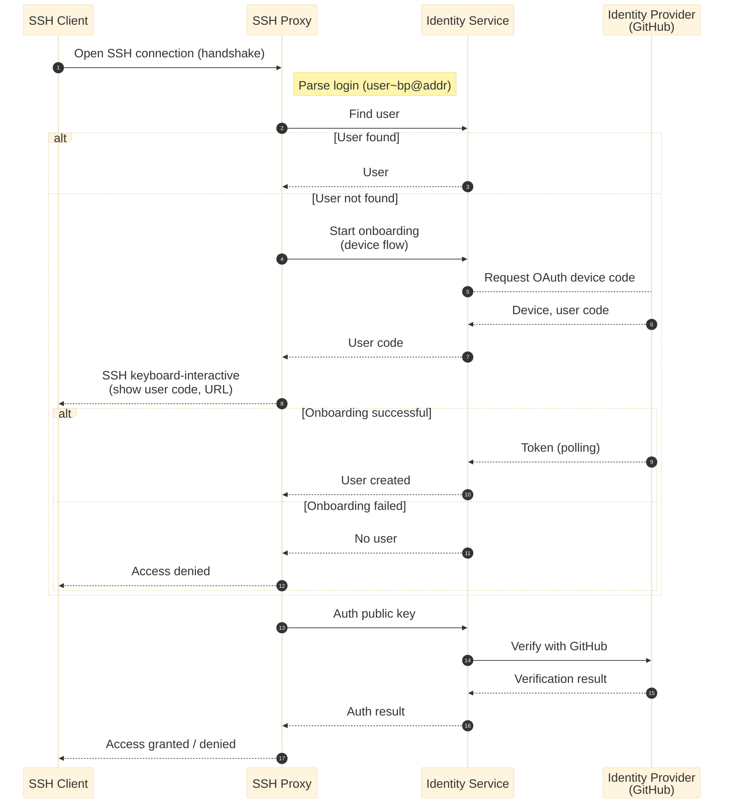
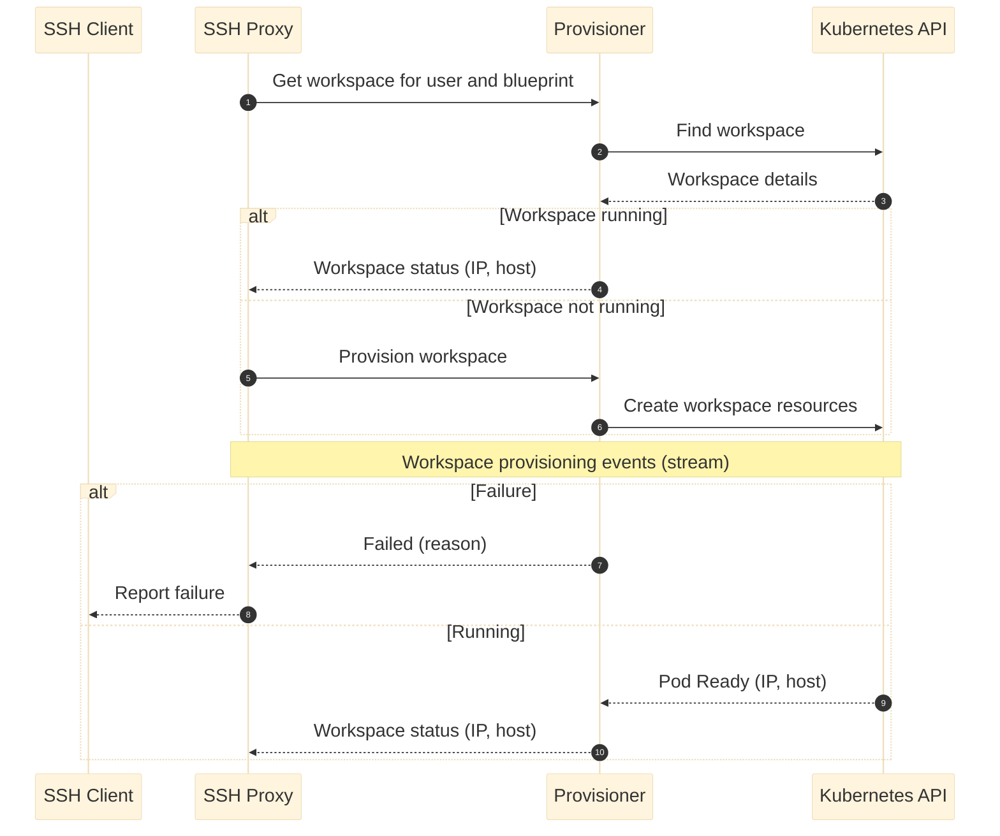
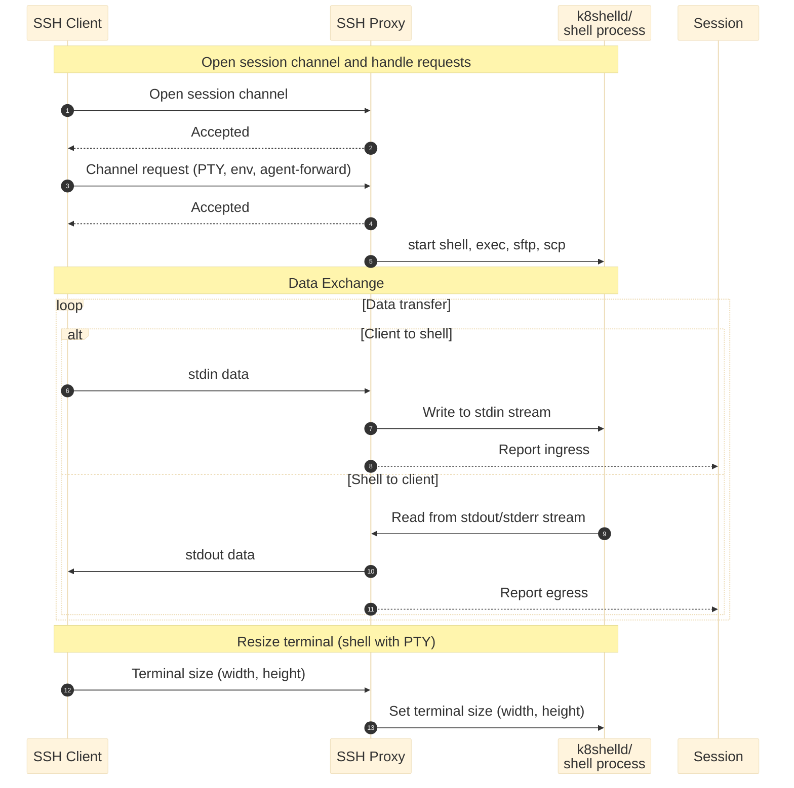
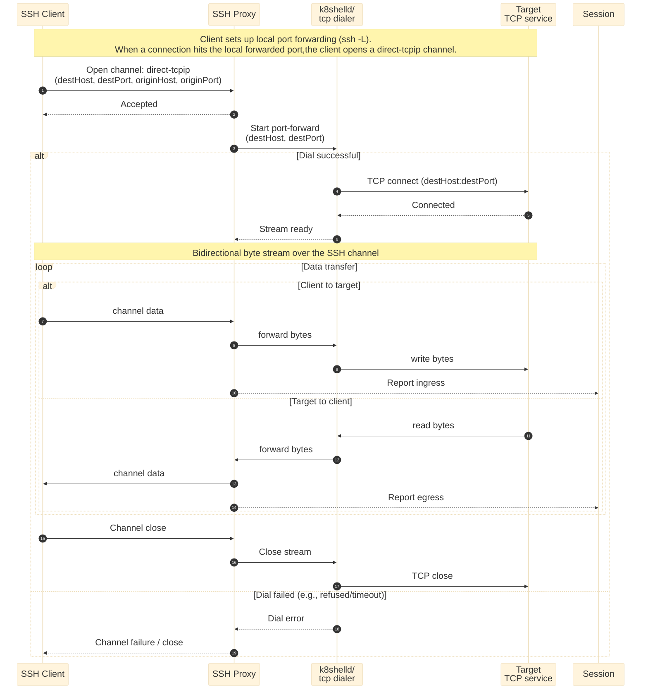
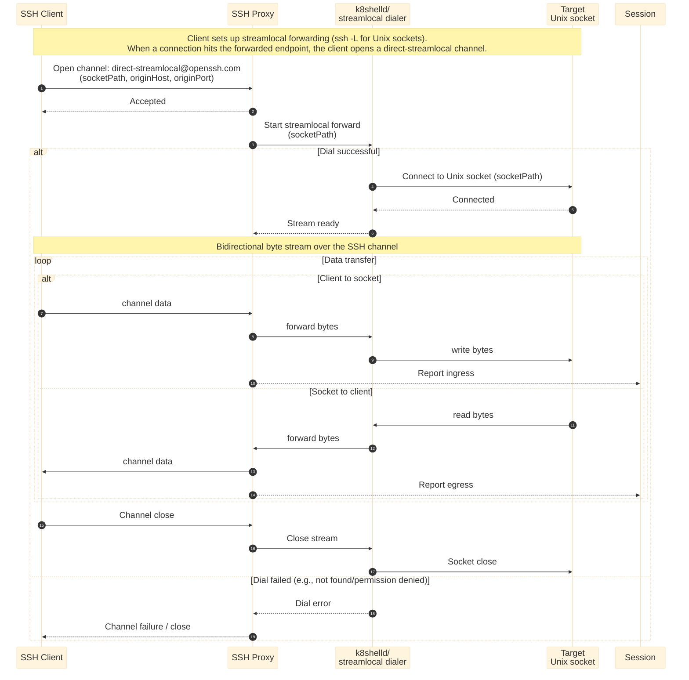
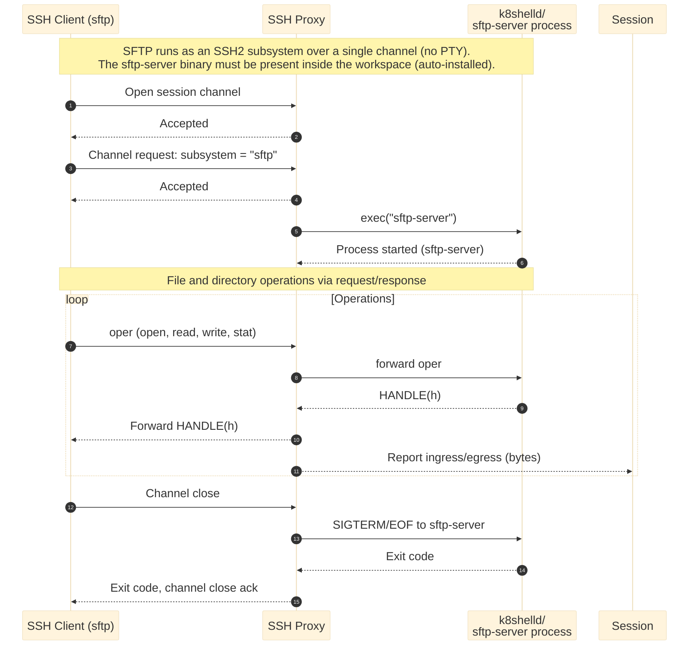
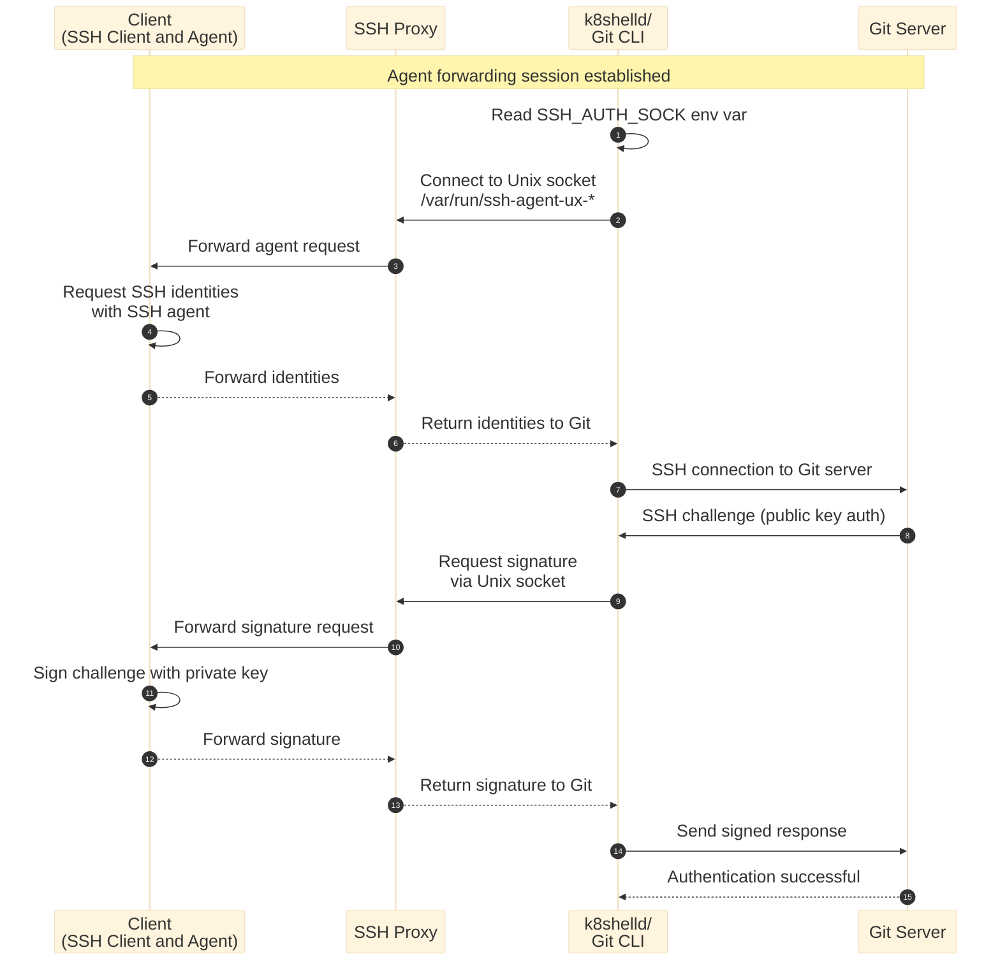

# Communication Flows

This document describes the flow between **SSH Client**, **SSH Proxy**, **Identity**, **Provisioner**, and **k8shelld**.Please refer to the [architecture overview](Architecture) for component details.

The flow is divided into three phases:  

- [Communication Flows](#communication-flows)
  - [User Discovery and Onboarding](#user-discovery-and-onboarding)
  - [Workspace Provisioning](#workspace-provisioning)
  - [SSH Channels Communication](#ssh-channels-communication)
    - [Session Channels](#session-channels)
    - [Direct TCP/IP Channels](#direct-tcpip-channels)
    - [Direct Streamlocal Channels](#direct-streamlocal-channels)
    - [File Transfer](#file-transfer)
    - [Agent Forwarding](#agent-forwarding)

## User Discovery and Onboarding

Users connect to SSH Proxy using a *user string* that contains their username and configuration parameters like blueprint name or repository details (see [User string specification](concepts/overview/user-string) for details). SSH Proxy parses this user string to extract the username and parameters, then looks up the corresponding internal user identity.

When no user identity is found, SSH Proxy checks whether the user can be onboarded through available identity providers. If onboarding is supported, it automatically initiates the onboarding process. When authentication fails, SSH proxy publishes the failed authentication attempt via NATS messaging middleware. See [IP Address Protection](ip-protection) for more details.

The diagram below illustrates the communication flow for user discovery and onboarding using the [OAuth Device Flow](https://auth0.com/docs/get-started/authentication-and-authorization-flow/device-authorization-flow), with GitHub shown as the example identity provider.

## Workspace Provisioning

Users can request workspace access through the user string in two ways: by specifying a blueprint name, or by specifying a Git repository name (for users onboarded via git-based identity providers). The Provisioner service manages workspace blueprints and retrieves blueprint definitions from Git repositories. SSH Proxy uses the user string to check if the requested workspace is running and requests to provision it when necessary.

The following diagram shows the communication flow for workspace provisioning. For more details on how the Provisioner service retrieves blueprint information and provisions workspaces, see the Provisioner service documentation.

## SSH Channels Communication

SSH Proxy accepts SSH channel requests and establishes connections with the workspace k8shelld process. Using workspace status details that contain the workspace IP address, it connects to k8shelld via gRPC protocol on TCP port `2822` and calls the `handshake` operation.

After the handshake completes, SSH Proxy creates a new SSH session with the Session service (when enabled) that tracks session information such as SSH Proxy ID, process ID, and workspace name. It then uses the SSH session ID to send periodic updates including ingress and egress data volumes, client IP, and client type information. 

SSH Proxy supports session channels, direct TCP/IP channels (port forwarding), and direct streamlocal channels (Unix domain socket forwarding).

### Session Channels

Session channels support shell access with or without PTY, SSH agent forwarding, environment variable requests, command execution, and SFTP/SCP requests. SSH Proxy reads and writes channel data to k8shelld using corresponding gRPC services.

The following diagram shows the communication flow in a session channel after the handshake is completed. 

### Direct TCP/IP Channels

Direct TCP/IP channels implement SSH **local port forwarding** (for example, `ssh -L 8080:127.0.0.1:8080 ...`). The SSH client opens a `direct-tcpip` channel and requests the SSH Proxy to connect to a destination host/port **from within the workspace network**. SSH Proxy delegates the outbound TCP dial to `k8shelld`, then tunnels bytes between the SSH channel and the TCP stream.

Typical use cases:

- Access a service listening inside the workspace (for example, `127.0.0.1:8080`, `localhost:5432`).
- Forward traffic to a workspace-reachable internal address (for example, a cluster service DNS name).

:::info
The port-forward **target** (destination host/port) can be controlled by configuration in the **workspace blueprint** (for example, to restrict which hosts/ports are allowed for `direct-tcpip` forwarding from within the workspace network).
:::

The following diagram shows the communication flow for a single `direct-tcpip` channel.

### Direct Streamlocal Channels

Direct streamlocal channels implement SSH **Unix domain socket forwarding** (OpenSSH: `direct-streamlocal@openssh.com`). The SSH client opens a `direct-streamlocal@openssh.com` channel and requests the SSH Proxy to connect to a destination **Unix socket path from within the filesystem namespace**. SSH Proxy delegates the outbound socket dial to `k8shelld`, then tunnels bytes between the SSH channel and the Unix socket stream.

Typical use cases:

- Forward traffic to a Unix socket inside the workspace (for example, `/var/run/docker.sock`, `/var/run/postgresql/.s.PGSQL.5432`).
- Connect to a workspace-local service that is only exposed via a Unix domain socket.

The following diagram shows the communication flow for a single `direct-streamlocal@openssh.com` channel.

### File Transfer 

SFTP and SCP are handled using k8shelld `exec` operations when the corresponding binary (`sftp` or `scp`) is executed directly in the workspace. Both binaries must be present in the workspace as part of the container image. SFTP is installed automatically during workspace initialization, while scp must be pre-installed in the image. Note that scp is a legacy protocol that many modern operating systems have replaced with SFTP.

### Agent Forwarding

Agent forwarding lets processes inside the workspace request signatures from the SSH agent on the user’s machine. When the SSH client requests agent forwarding (`auth-agent-req@openssh.com`), the SSH Proxy (via k8shelld) creates a Unix domain socket at `/var/run/ssh-agent-ux-{proxy-id}-{proxy-pid}-{channel-num}.sock` in the workspace and sets the environment variable `SSH_AUTH_SOCK` for the session. 

:::warning
Agent forwarding is a standard SSH feature (OpenSSH: `ssh -A` / `ForwardAgent yes`), but it can introduce security risks. Any process on the forwarded-to host that can access the forwarded agent socket may be able to use your agent to authenticate to other systems *as you* (without extracting your private key), so it should only be enabled for trusted hosts.

For accessing remote systems (for example, Git repositories), we recommend using a **Git credential helper** that integrates with k8shell via the API server instead of relying on agent forwarding. For more information see [K8shell Credential Helpers]().
:::

The following sequence diagram shows how agent forwarding works in the workspace when a user uses a GIT CLI to clone a remote repository e.g. `git clone git@github.com:user/repo.git` for which there exists a key on the host machine. This assumes that the session with `auth-agent-req@openssh.com` request has been established. Please note that the same protocol flow applies when accessing any remote SSH server, not only when using Git.

