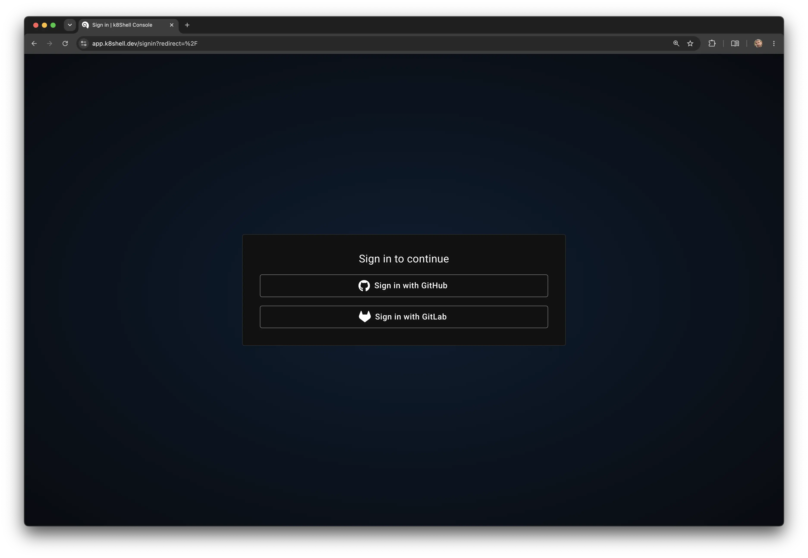

# Console <EarlyAccessBadge />

The Console is the browser-based interface for managing workspaces, accessing applications, and running terminals — all without installing any local tools.

## Signing In

On the sign-in page, select the [identity provider](/architecture/identity/providers) (IdP) you want to authenticate with and follow the on-screen instructions. The available providers are configured by your administrator and may include GitHub, GitLab, or a built-in user directory. Your account is tied to the provider you sign in with, so use the same one on each visit.

## User Settings

User settings are accessible from any page by clicking your avatar in the top-right corner and selecting **Settings**. From there you can set the interface language, switch between light, dark, or system theme, and view the application version.
