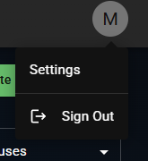

# User Tasks

## Signing In

> Available providers may vary. They are controlled by the system admin.

- Click on any of the available providers and follow the directions on the screen.

## Changing User Settings

- User settings are available after clicking on the user avatar in the top right corner of any screen.

  

- Click on `Settings` to navigate to the settings page.
- Here you can:
  - Set the application language
  - Set the application theme (light, dark, or system)
  - Display information about the application version
