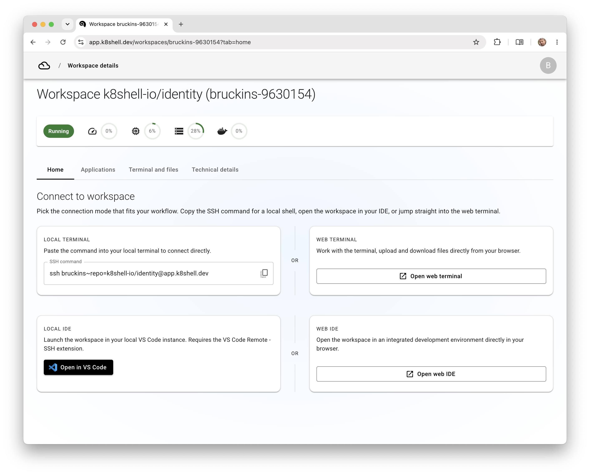
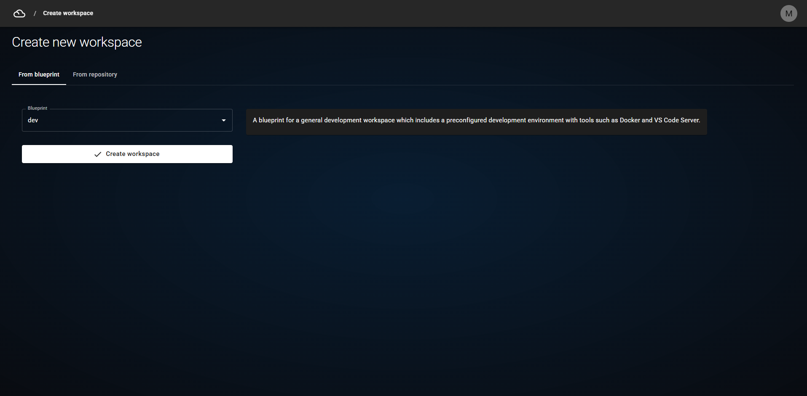
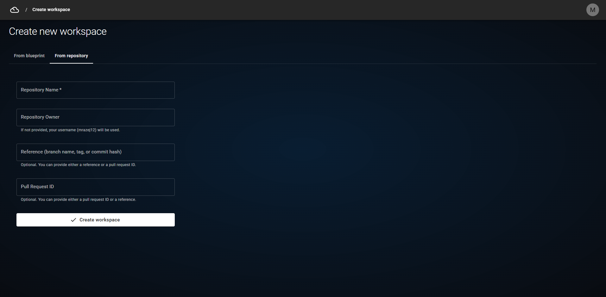
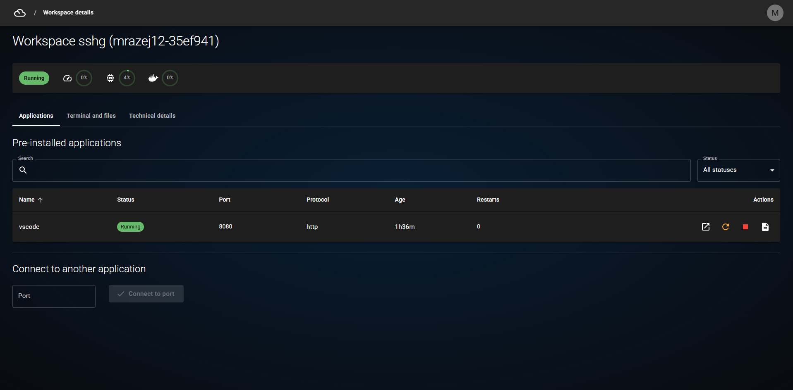
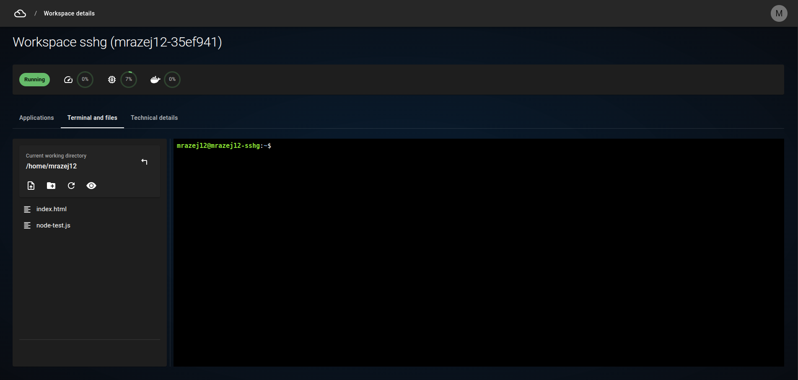
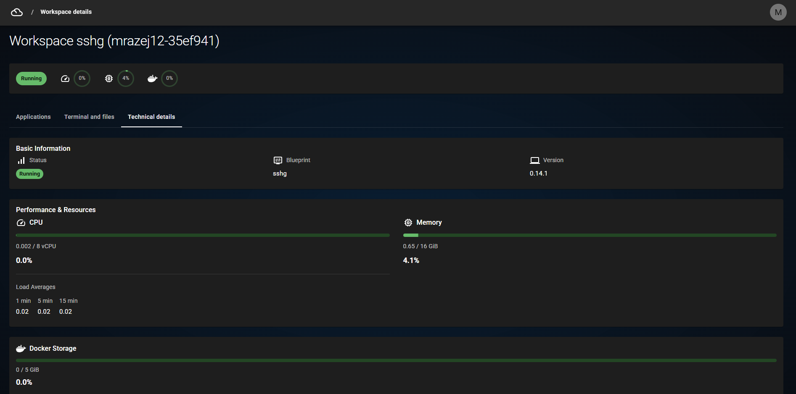

# Workspaces

## Listing Workspaces

- Go to the homepage by clicking the application logo in the top left corner.
- You can see your workspaces and perform actions:
  - To delete a workspace, click the red trash can icon and confirm.
  - To view workspace installation logs, click the file icon in the `Actions` column.

## Creating a New Workspace

- On the homepage, click the `Create new workspace` button.
- Choose the correct origin for the workspace.

### Blueprint

> This origin contains blueprints available to you. A blueprint defines workspace parameters, preinstalled dependencies, and network permissions. Blueprints are predefined by the system administrator. If you don't see a blueprint you should have access to, contact your administrator.

- Choose a blueprint from the dropdown menu.
- Click `Create workspace`.

### Git Repository

> This origin lets you create a workspace pre-loaded with a specified Git repository.

- Fill out the form:
  - **Repository name** — the only mandatory field. Enter the repository name from Git.
  - **Repository owner** — the group or username that owns the repository. Leave blank if the repository is under your own Git namespace.
  - **Reference** — a commit SHA, tag, or branch name. Defaults to `main` if left blank.
  - **Pull Request ID** — the ID of a pull request (merge request) from the Git provider (GitLab, GitHub).
- Click `Create workspace`.

## Interacting with a Workspace

- On the homepage, click the workspace `Origin` to open its detail page.
- Use the tabs to switch between **Applications**, **Terminal and files**, and **Technical details**.
- A quick resource overview is shown below the heading on every workspace page.

### Applications

- Select the `Applications` tab.

  

- Preinstalled applications are listed in the table with available actions.
- If you launched an application running on a port inside the workspace (e.g. a web server), connect to it by pressing `Connect to port` and specifying the port number.

### Terminal and Files

- Select the `Terminal and files` tab.

  

#### Terminal

- Click the terminal pane to focus it (the cursor starts blinking).
- Supported Linux shortcuts:
  - `Ctrl+C` — end a running program
  - `Ctrl+D` — end the session

#### File Explorer

- The file explorer lets you upload and download files.
- The current working directory is shown at the top of the explorer.
  - When no directory is selected, topbar actions (new directory, upload) apply to the current working directory.
  - Double-click a directory, or right-click and select `Set as work directory`, to make it the current working directory.
  - Click the arrow icon next to the current working directory to navigate up.
- Create a new directory with the topbar button:
  - No selection → created in the current working directory.
  - A directory selected → created inside that directory.
- Upload files by:
  - Dragging them directly onto a directory.
  - Dragging them into the empty space below to upload to the current working directory.
  - Pressing the upload button (with or without a directory selected) to open a dialog where you can drop or choose files.
- Right-click a file or directory and choose `Delete` to remove it.
- Toggle hidden files with the topbar button.

### Workspace Status and Technical Details

- Select the `Technical details` tab to view the workspace status and technical information.

  
