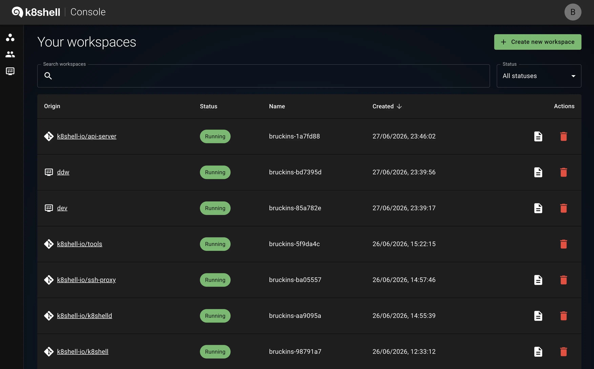
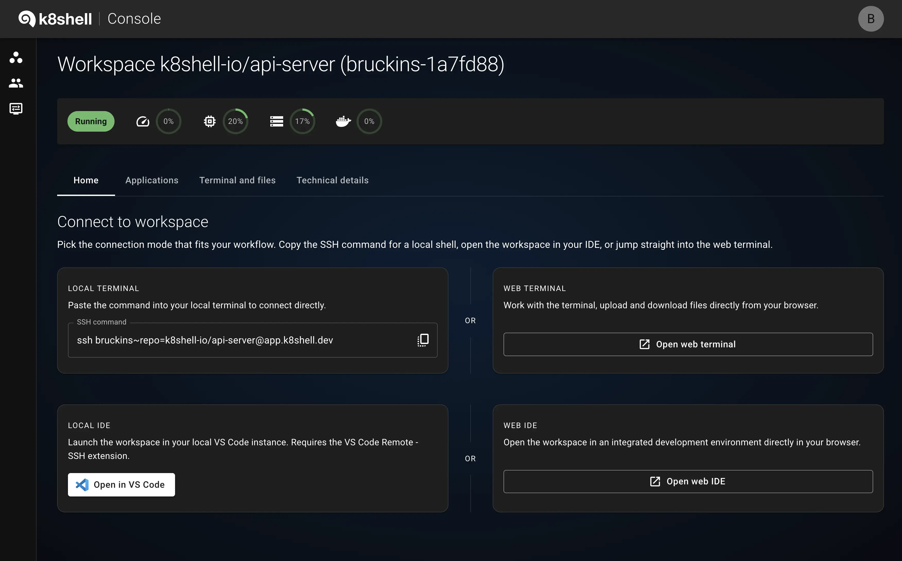
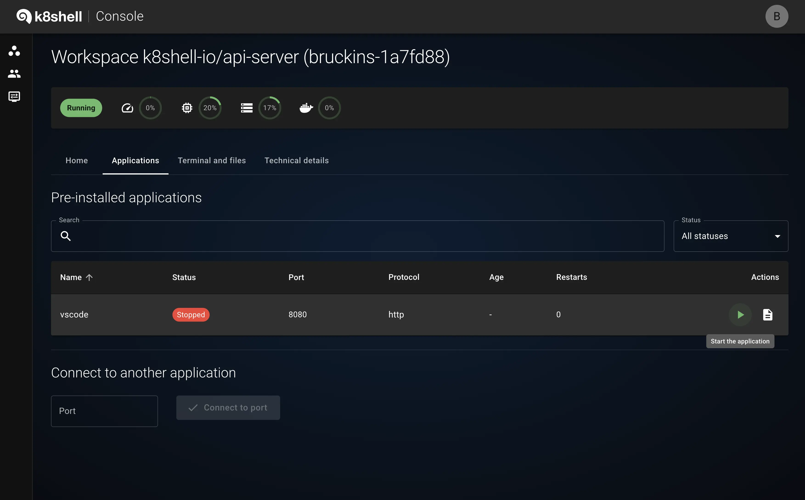
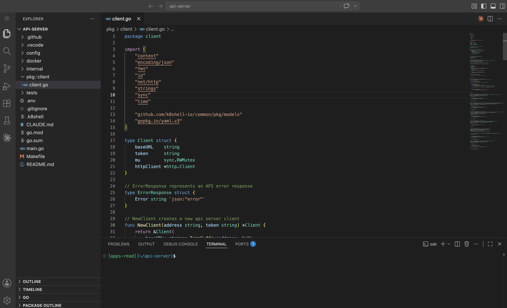
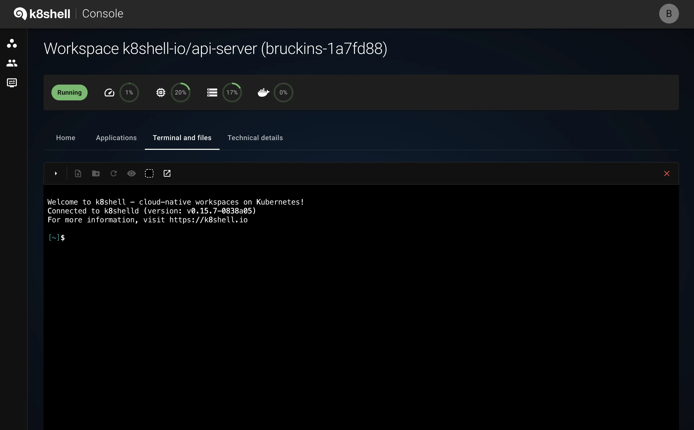

# Workspaces

A [workspace](/architecture/overview/workspace) is an isolated cloud development environment provisioned for a specific user. Each workspace is created from an origin — either a [blueprint](/architecture/overview/blueprint) (a predefined configuration set by your administrator) or a Git repository — and comes preloaded with dependencies, applications, and a terminal. You can run applications, manage files, and connect to services running inside the workspace, all from the browser.

## Listing Workspaces

Navigate to the homepage by clicking the application logo in the top-left corner. Your workspaces are listed here.

Available actions per workspace:

- Click the workspace to open its dashboard.
- Click the file icon in the `Actions` column to view installation logs.
- Click the red trash can icon to delete the workspace.

## Workspace Dashboard

Click a workspace to open its dashboard. Use the tabs to switch between **Applications**, **Terminal and files**, and **Technical details**. A quick resource overview is shown below the heading on every workspace page.

### Applications

Preinstalled [applications](/architecture/workspace/apps) are listed with available actions. If you launched a process on a port inside the workspace (e.g. a web server), click `Connect to port` and enter the port number to open it in the browser.

Application connectivity is handled by the [reverse proxy](/architecture/api-server/access#reverse-proxy) in the API Server, which routes browser traffic to in-workspace processes. The example below shows VS Code accessed this way.

### Terminal and Files

Click the terminal pane to focus it. Supported shortcuts: `Ctrl+C` ends a running program, `Ctrl+D` ends the session.

The file explorer lets you upload and download files. The current working directory is shown at the top; double-click a directory or right-click and select `Set as work directory` to change it, and use the arrow icon to navigate up. Topbar buttons let you create a new directory (inside the selected directory, or in the current working directory if nothing is selected) and upload files. You can also upload by dragging files onto a directory or into the empty space below. Right-click any file or directory and choose `Delete` to remove it. Toggle hidden files with the topbar button.
